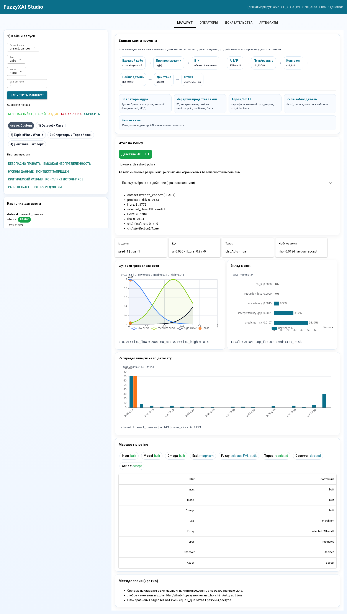
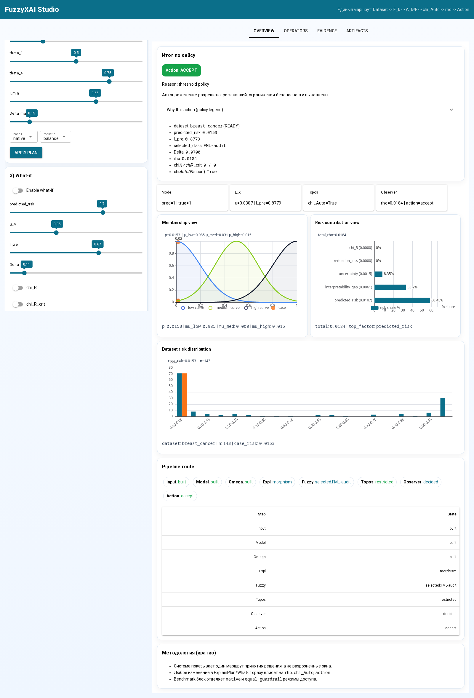
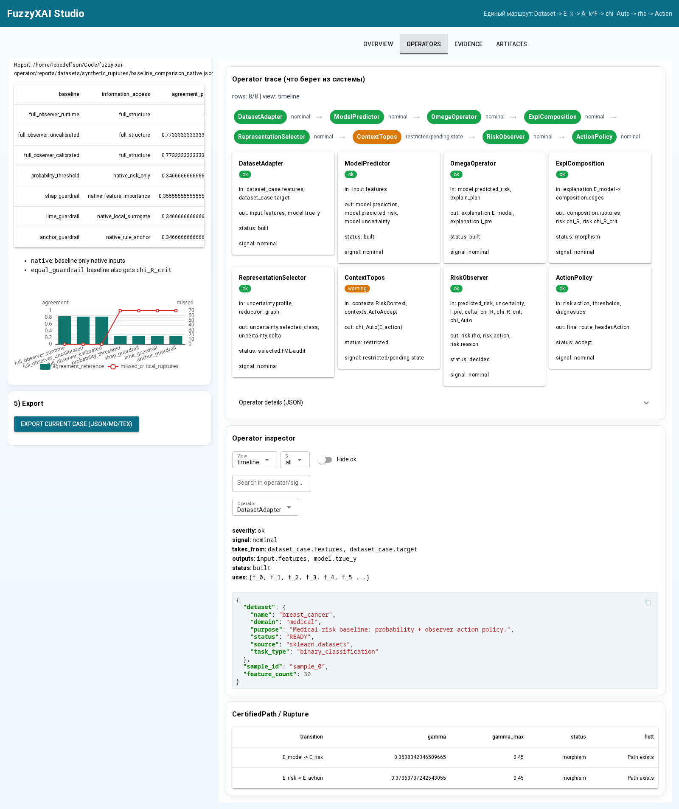
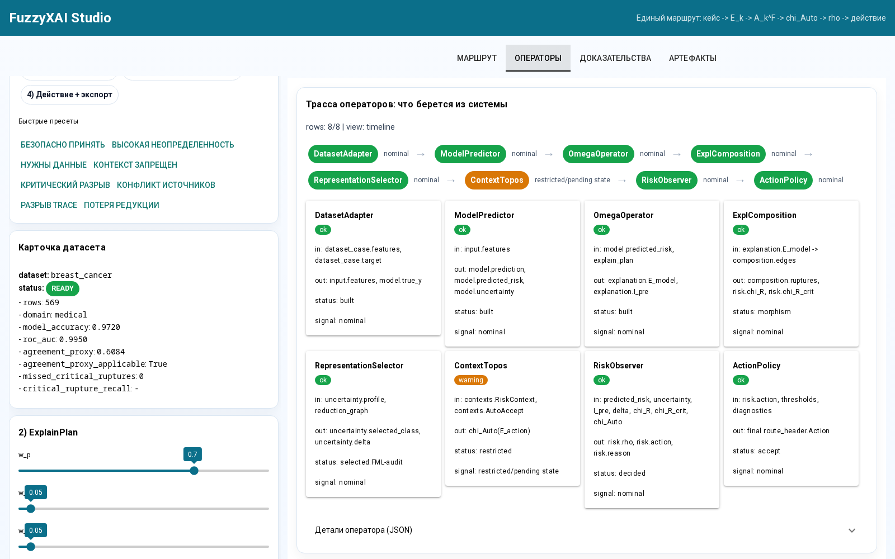
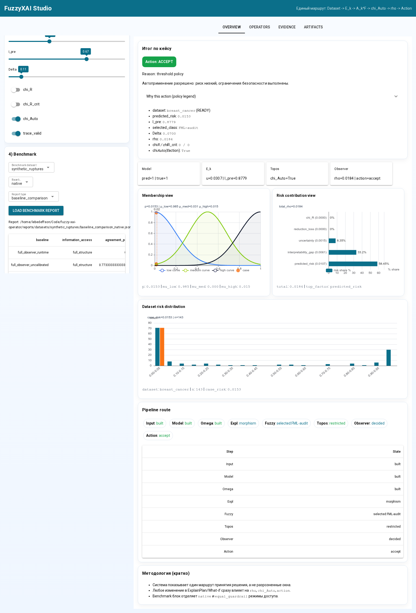

# Глава 5. Экспериментальная проверка и воспроизводимые артефакты

В данной главе описана экспериментальная проверка программной реализации наблюдающего контура FuzzyXAI. Цель экспериментов состоит не только в оценке качества базовой модели, но и в проверке safety-свойств: корректной блокировки критических разрывов, влияния контекстного слоя, роли редукции представлений и воспроизводимости расчётов.

## 5.1. Единая демонстрационная среда

Интерактивная реализация сведена в единую среду `FuzzyXAI Studio`. В одном интерфейсе отображается маршрут `Dataset -> E_k -> A_k^F -> chi_Auto -> rho -> Action`, что позволяет проверять не отдельные скрипты, а полный контур принятия решения.

Рисунок 5.1 показывает общий экран: выбор датасета и сценария, итоговое действие, функцию принадлежности, вклад компонентов риска, распределение риска по датасету и маршрут pipeline.

Рисунок 5.2 иллюстрирует интерактивную проверку параметров риска, интерпретируемости, потери редукции, `chi_R`, `chi_R^crit`, `chi_Auto` и trace-состояния.

Рисунок 5.3 показывает, какие операторы используются в цепочке и какие поля системы они читают: модельный прогноз, объяснительный объект, контекст, путь/разрыв и действие наблюдателя.

Рисунок 5.4 визуализирует последовательность операторов и диагностические состояния переходов.

## 5.2. Датасеты и роли режимов

| Режим данных | Роль в эксперименте | Интерпретация результата |
| --- | --- | --- |
| breast_cancer | количественная медицинская проверка | проверка модели, наблюдателя, I_pre, rho и калибровки |
| wine_risk | табличная переносимость | проверка применимости контура вне медицинского набора |
| synthetic_ruptures | diagnostic/safety стенд | контролируемые критические разрывы и проверка chi_R^crit -> block |
| diabetes_binary | stress-test калибровки | пограничная неопределенность и чувствительность политики |
| registry_* | external-transfer/readiness | подключение внешних предметных источников без claims о качестве модели |

## 5.3. Breast Cancer Wisconsin

| Метрика | Значение |
| --- | ---: |
| n | 569 |
| model_accuracy | 0.9720 |
| model_roc_auc | 0.9950 |
| model_f1 | 0.9608 |
| precision | 1.0000 |
| recall | 0.9245 |
| agreement_proxy | 0.6084 |
| missed_critical_ruptures | 0 |
| false_auto_accept_rate | 0.0000 |

На Breast Cancer Wisconsin вероятностный baseline является сильным, поскольку reference-политика существенно зависит от вероятности модели. Поэтому этот режим используется как проверка воспроизводимости полного контура и калибровки, а не как единственное доказательство преимущества над risk-only baseline.

## 5.4. Распределения I_pre и rho

| Показатель | mean | std | median | p25 | p75 | p05 | p95 |
| --- | ---: | ---: | ---: | ---: | ---: | ---: | ---: |
| I_pre | 0.7936 | 0.0289 | 0.7914 | 0.7811 | 0.8050 | 0.7453 | 0.8422 |
| rho | 0.2077 | 0.1501 | 0.1385 | 0.0613 | 0.3432 | 0.0566 | 0.4606 |

## 5.5. Калибровка наблюдателя

Калибровка выполняется на validation-разбиении и оценивается отдельно; прогнозная модель при этом не изменяется.

| Режим | agreement_proxy | agreement_reference | missed_critical | critical_recall | false_auto_accept |
| --- | ---: | ---: | ---: | ---: | ---: |
| до калибровки | 0.7063 | 0.7343 | 0 | 1.0000 | 0.0000 |
| после калибровки | 0.9580 | 0.9301 | 0 | 1.0000 | 0.0000 |

Целевая функция калибровки: `maximize agreement_reference - 5*missed_critical_ruptures - 2*false_auto_accept_rate - false_block_rate with hard safety penalties`.
Лучшие параметры: weights=`{'predicted_risk': 0.5, 'uncertainty': 0.2, 'interpretability_gap': 0.1, 'reduction_loss': 0.1, 'diagnostic': 0.1}`, thresholds=`[0.12, 0.28, 0.52, 0.8]`, gamma_max=`0.4`, I_min=`0.6`, Delta_max=`0.12`.

## 5.6. Diagnostic safety: synthetic_ruptures

Для проверки диагностического слоя используется два режима доступа. В `native` baseline-методы не получают `chi_R^crit`; в `equal_guardrail` всем методам передаётся внешний safety-флаг. Поэтому `equal_guardrail` служит sanity-check, а научное сравнение проводится в `native`.

| Метод | access | agreement_ref | missed_critical | critical_recall | false_auto_accept |
| --- | --- | ---: | ---: | ---: | ---: |
| full_observer_runtime | full_structure | 0.8356 | 0 | 1.0000 | 0.0000 |
| full_observer_uncalibrated | full_structure | 0.8222 | 0 | 1.0000 | 0.0000 |
| full_observer_calibrated | full_structure | 0.8222 | 0 | 1.0000 | 0.0000 |
| probability_threshold | native_risk_only | 0.2533 | 70 | 0.0000 | 0.5911 |
| shap_guardrail | native_feature_importance | 0.2533 | 70 | 0.0000 | 0.5644 |
| lime_guardrail | native_local_surrogate | 0.2533 | 70 | 0.0000 | 0.5867 |
| anchor_guardrail | native_rule_anchor | 0.2533 | 70 | 0.0000 | 0.5733 |

В `native`-режиме полный наблюдатель не пропускает критические разрывы (`missed_critical_ruptures=0`, `critical_rupture_recall=1.0`), тогда как risk-only и XAI-baseline без структурного индикатора пропускают 70 критических случаев.

### Equal-guardrail sanity-check

| Метод | access | agreement_ref | missed_critical | critical_recall | false_auto_accept |
| --- | --- | ---: | ---: | ---: | ---: |
| full_observer_runtime | full_structure | 0.8356 | 0 | 1.0000 | 0.0000 |
| full_observer_uncalibrated | full_structure | 0.8222 | 0 | 1.0000 | 0.0000 |
| full_observer_calibrated | full_structure | 0.8222 | 0 | 1.0000 | 0.0000 |
| probability_threshold | equal_guardrail | 0.8711 | 0 | 1.0000 | 0.0000 |
| shap_guardrail | equal_guardrail | 0.8578 | 0 | 1.0000 | 0.0000 |
| lime_guardrail | equal_guardrail | 0.8667 | 0 | 1.0000 | 0.0000 |
| anchor_guardrail | equal_guardrail | 0.8533 | 0 | 1.0000 | 0.0000 |

## 5.7. Structure-aware benchmark

Эксперимент использует реальные строки Breast Cancer Wisconsin и контролируемые perturbation-сценарии: `clean, context_forbidden, critical_rupture, high_reduction_loss, rule_conflict, source_conflict, trace_gap`. Число кейсов: `252`.

| Policy | agreement_ref | missed_critical | critical_recall | false_auto_accept | auto_accept_cov |
| --- | ---: | ---: | ---: | ---: | ---: |
| full_observer_calibrated | 0.8889 | 0 | 1.0000 | 0.0913 | 0.2698 |
| probability_threshold | 0.5437 | 0 | 1.0000 | 0.4365 | 0.5238 |
| shap_guardrail | 0.5437 | 0 | 1.0000 | 0.4365 | 0.5238 |
| lime_guardrail | 0.5437 | 0 | 1.0000 | 0.4365 | 0.5238 |
| anchor_guardrail | 0.5437 | 0 | 1.0000 | 0.4365 | 0.5238 |

## 5.7a. Несинтетические улучшения на реальных строках

Ниже сводка structure-aware прогонов на реальных датасетах (с контролируемыми perturbation-сценариями). Показаны прирост `agreement_reference` и снижение `false_auto_accept_rate` относительно risk-only threshold.

| Dataset | full_agreement_ref | threshold_agreement_ref | agreement_gain | full_false_auto_accept | threshold_false_auto_accept | false_auto_accept_drop |
| --- | ---: | ---: | ---: | ---: | ---: | ---: |
| breast_cancer | 0.8889 | 0.5437 | 0.3452 | 0.0913 | 0.4365 | 0.3452 |
| wine_risk | 0.8770 | 0.5238 | 0.3532 | 0.0992 | 0.4563 | 0.3571 |
| diabetes_binary | 0.8810 | 0.8333 | 0.0476 | 0.0238 | 0.0794 | 0.0556 |

## 5.7b. Сценарии внешних модулей как проверка экосистемы

Сценарии ЭКГ/табличных объяснений, глазного дна, AFLC/ANZA-LIRA, BEACON-XAI, GIS INTEGRO и других registry-модулей используются как проверка экосистемного маршрута `registry -> adapter -> explanation/report -> action`, а не как полноценный benchmark исходных моделей. Поэтому для этих сценариев не вводятся искусственные таблицы `accuracy` или `missed_critical_ruptures`: если pinned baseline-метрики отсутствуют, поля количественного сравнения помечаются как `not_available` или `N/A`.

Это ограничение является осознанным: глава 5 демонстрирует применимость единого интерфейса, SDK, реестра и evidence-пакета к внешним артефактам, а главные количественные safety-результаты приведены в диагностических benchmark-разделах и приложениях.

## 5.8. Абляционный анализ

| Mode | agreement_proxy | missed_critical | critical_recall | false_auto_accept | auto_accept_cov | mean_reduction_loss |
| --- | ---: | ---: | ---: | ---: | ---: | ---: |
| full | 0.6503 | 0 | 1.0000 | 0.0000 | 0.5175 | 0.0788 |
| no_trace | 0.6503 | 0 | 1.0000 | 0.0000 | 0.5175 | 0.0788 |
| no_delta | 0.6573 | 0 | 1.0000 | 0.0000 | 0.5175 | 0.0000 |
| no_critical_rupture | 0.6503 | 0 | 1.0000 | 0.0000 | 0.5175 | 0.0788 |
| f0_only | 0.6294 | 0 | 1.0000 | 0.0000 | 0.5175 | 0.2500 |
| no_topos | 0.6014 | 0 | 1.0000 | 0.0490 | 0.5664 | 0.0788 |
| probability_threshold | 0.8042 | 0 | 1.0000 | 0.1958 | 0.7133 | 0.0788 |

Абляция показывает, что отключение контекстного слоя (`no_topos`) увеличивает долю ложного автоматического применения, а переход к `f0_only` повышает среднюю потерю редукции. Простое пороговое правило по вероятности имеет высокую proxy-согласованность на risk-dominated разметке, но даёт более высокую долю автоматического применения и не проверяет структурные ограничения.

## 5.9. Воспроизводимость

| Команда | Назначение |
| --- | --- |
| `make dissertation-check` | полная проверка тестов, датасетов, отчётов и карточек |
| `make thesis-practice-tables` | пересборка таблиц для диссертации/статьи |
| `make browser-visual-check` | актуальные скриншоты GUI через Chromium |
| `make ui-health-check` | smoke-check единого GUI |
| `make reproducibility-artifacts` | manifest, ExplainPlan hash и готовые материалы для текста |

Ключевые артефакты и SHA256 приведены в `reports/reproducibility_artifacts/manifest.md` и `reports/reproducibility_artifacts/article_insert.md`.

## 5.10. Вывод по главе

Экспериментальная часть показывает, что предложенный контур воспроизводимо строит объяснительные объекты, вычисляет метрики интерпретируемости и риска, выбирает представление неопределённости и применяет safety-политику. Основное преимущество метода проявляется не в превосходстве над risk-only baseline на каждом табличном наборе, а в структуральной проверке условий автоматического применения: критический разрыв `chi_R^crit=1` приводит к `block`, контекстный слой ограничивает `accept`, а редукция представлений контролируется через `Delta`.
